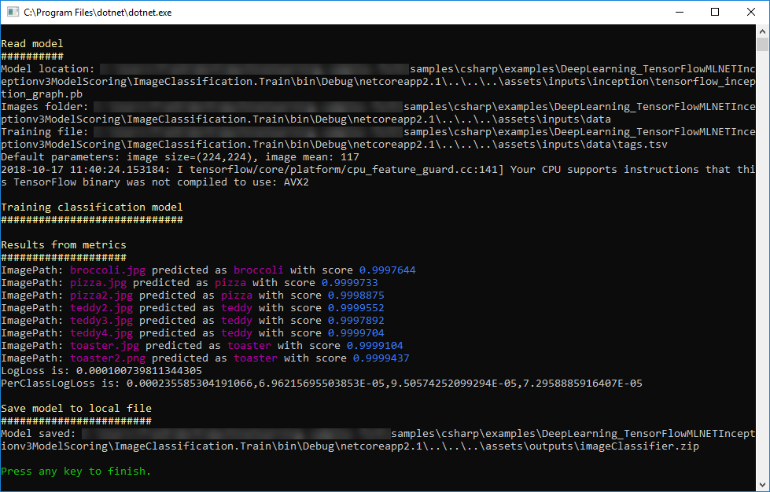
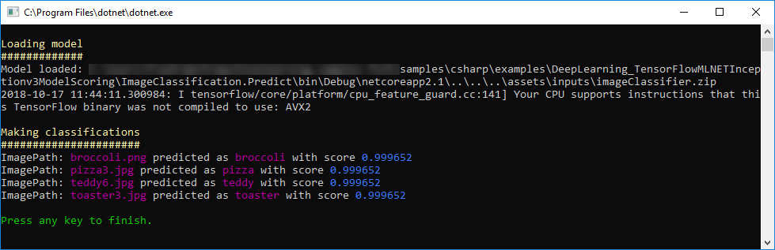
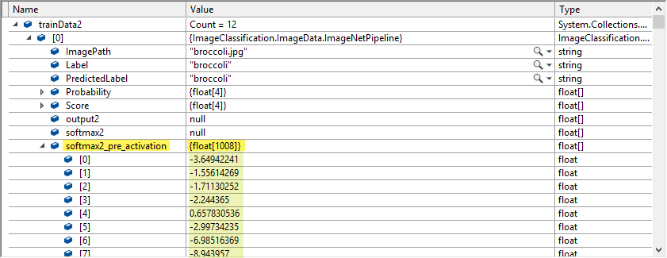

# Image Classification
## Problem
Train your own model for classifying images, using a mix of new (deep learning) and old (SDCA) techniques. Later, you can use the custom model to classify images.
## Solution
The solution file `ImageClassification.sln` contains two projects: `ImageClassification.Train` and `ImageClassification.Predict`. You should proceed as follows in order to train a model and predict with your model:
1) Set VS default startup project: Set `ImageClassification.Train` as starting project in Visual Studio
2) Run the training model console app: it F5 in Visual Studio. After some seconds, the process will finish and the output should be similar to the following screenshot:

3) Copy the model produced by the training model (located at [ImageClassification.Train](./ImageClassification.Train/)/[assets](./ImageClassification.Train/assets/)/[outputs](./ImageClassification.Train/assets/outputs/)/[imageClassifier.zip](./ImageClassification.Train/assets/outputs/imageClassifier.zip) ) to the prediction project (at [ImageClassification.Predict](./ImageClassification.Predict/)/[assets](./ImageClassification.Predict/assets/)/[inputs](./ImageClassification.Predict/assets/inputs/)/[imageClassifier.zip](./ImageClassification.Predict/assets/inputs/imageClassifier.zip) ).
4) Set VS default startup project: Set `ImageClassification.Predict` as starting project in Visual Studio
5) Run the prediction console app: it F5 in Visual Studio. After some seconds, the process will finish and the output should be similar to the following screenshot:



# Code Walkthrough

## ML.NET: Model training
The TextLoader.CreateReader() is used to define the schema of the text file that will be used to load images in the training model.
```csharp
var reader = TextLoader.CreateReader(env,
    ctx => (ImagePath: ctx.LoadText(0), Label: ctx.LoadText(1)));
```
The [data file](./ImageClassification.Train/assets/inputs/data/tags.tsv) used to load images has two columns: the first one is defined as `ImagePath` and the second one is the `Label` corresponding to the image. As you can observe, the file does not have a header row, and looks like this:
```tsv
broccoli.jpg	broccoli
pizza.jpg	pizza
pizza2.jpg	pizza
teddy2.jpg	teddy
teddy3.jpg	teddy
teddy4.jpg	teddy
toaster.jpg	toaster
toaster2.png	toaster
```
The second step is to define the estimator pipe. Usually, when dealing with deep neural networks, you must adapt the images to the format expected by the network. This is the reason images are resized and then transformed (mainly, pixel values are normalized across all R,G,B channels).
```csharp
var estimator = reader.MakeNewEstimator()
    .Append(row => (
        row.Label,
        input: row.ImagePath
                    .LoadAsImage(imagesFolder)
                    .Resize(ImageNetSettings.imageHeight, ImageNetSettings.imageWidth)
                    .ExtractPixels(interleaveArgb: ImageNetSettings.channelsLast, offset: ImageNetSettings.mean)))
    .Append(row => (row.Label, LabelToKey: row.Label.ToKey(), softmax2_pre_activation: row.input.ApplyTensorFlowGraph(featurizerModelLocation)))
    .Append(row => (row.Label, preds: sdcaContext.Trainers.Sdca(row.LabelToKey, row.softmax2_pre_activation)))
    .Append(row => (row.Label, 
                    Score: row.preds.score, 
                    PredictedLabel: row.preds.predictedLabel.ToValue()
                    ));
```
In this model, we use the [Inception model](https://storage.googleapis.com/download.tensorflow.org/models/inception5h.zip) as a *featurizer* (the model is already stored in the [assets folder](./ImageClassification.Train/assets/inputs/inception/) ). This means that the model will process input images through the neural network, and then it will use the output of the tensor which precedes the classification. This tensor is a feature vector, which allows to identify an image. In other words: the neural networks translate the image to a fixed array (`float[1008]`), and we will use this array to train the learner (an SDCA). In the following screenshot, you can see the value of the vector which is used to train the model:


In order to begin the training, we declare a datasource and then execute `Fit` on the built pipeline:
```csharp
var dataSource = new MultiFileSource(dataLocation);
var model = estimator.Fit(reader.Read(dataSource));
```

After the training, we evaluate the model using the training data. The `Evaluate` function needs a `IDataView` as parameter, so we apply `Transform` to the model, and then take the `AsDynamic` value.
```csharp
var trainData = model.Transform(reader.Read(dataSource)).AsDynamic;
var metrics = sdcaContext.Evaluate(trainData, label: "LabelToKey", predictedLabel: "PredictedLabel");
```

Finally, we save the model:
```csharp
using (var f = new FileStream(outputModelLocation, FileMode.Create))
    model.AsDynamic.SaveTo(env, f);
```

## ML.NET: Model prediction
First, we need to load the model created during Model training
```csharp
ITransformer loadedModel;
using (var f = new FileStream(modelLocation, FileMode.Open))
    loadedModel = TransformerChain.LoadFrom(env, f);
```

Then, we proceed to create a predictor function, and make predictions:
```csharp
var predictor = loadedModel.MakePredictionFunction<ImageNetData, ImageNetPrediction>(env);
var pred = predictor.Predict(testImage);
```
The prediction function receives as parameter an object of type `ImageNetData` (containing 2 properties: `ImagePath` and `Label`). Then returns and object of type `ImagePrediction`, which holds the `PredictedLabel` and `Score` (*probability* value between 0 and 1) properties.

### Citation
Training and prediction images 
> *Wikimedia Commons, the free media repository.* Retrieved 10:48, October 17, 2018 from https://commons.wikimedia.org/w/index.php?title=Main_Page&oldid=313158208.
